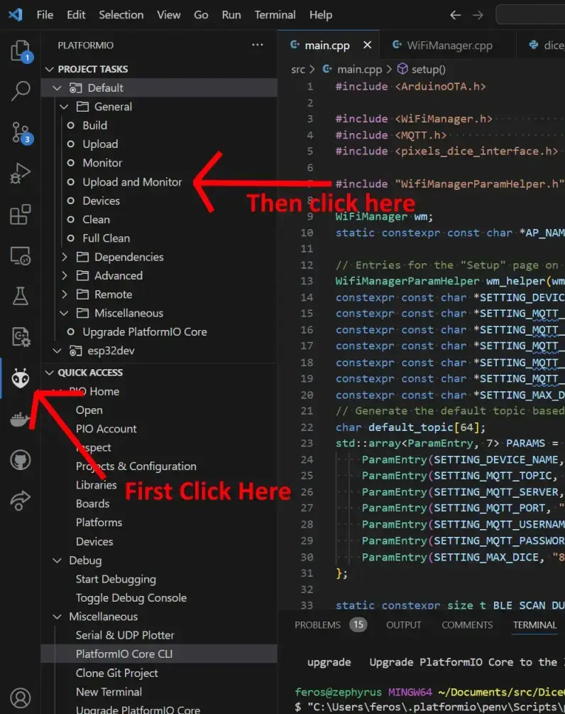
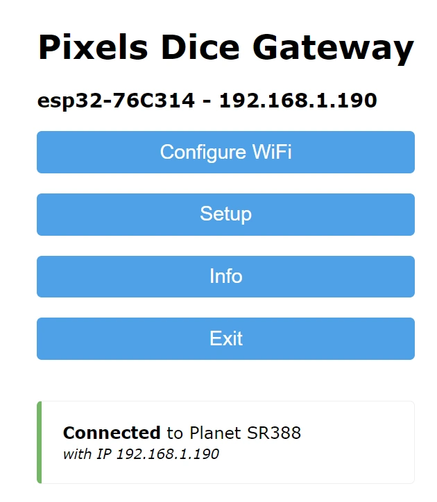
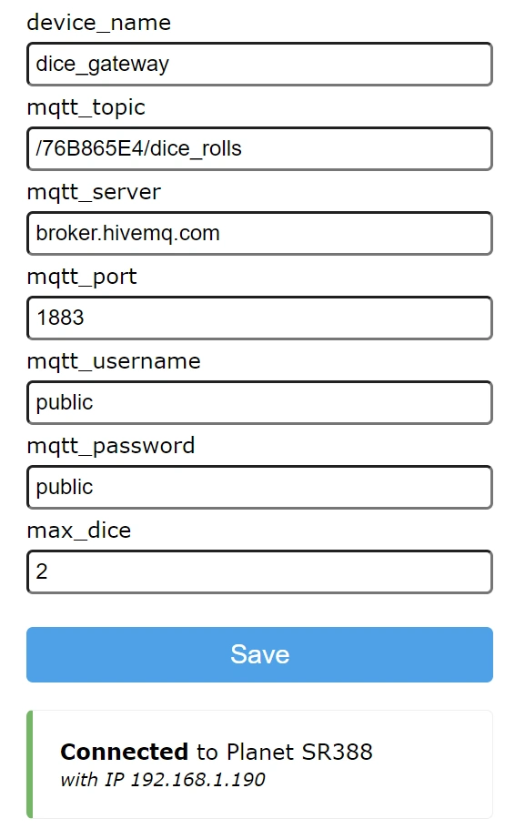

# Pixel Dice ESP32 Gateway

A ESP32 project to provide an interface for Pixel Dice to a WiFi network or other embedded applications.

Currently this just supports publishing the dice rolls to an MQTT server.

This project is basically a mash-up of the following libraries:
 - <https://github.com/tzapu/WiFiManager> - WiFi configuration management and web portal 
 - <https://github.com/axlan/arduino-pixels-dice> - Pixels dice BLE interface
 - <https://github.com/256dpi/arduino-mqtt> - MQTT client

# Installation

This repository contains project files for the build tool PlatformIO. The easiest way to use it is as a VSCode extension. See <https://docs.platformio.org/en/stable/integration/ide/vscode.html> for a getting started guide.

Once the PlatformIO project is open:

This will try to autodetect the ESP32 serial port, but if you have multiple serial devices, you may need to set the [upload_port](https://docs.platformio.org/en/latest/projectconf/sections/env/options/upload/upload_port.html) setting in the `platformio.ini` file.

# Setup

Once the ESP32 is running the firmware you'll need to setup the WiFi and MQTT settings.

If the ESP32 can't connect to an existing WiFi network, it will make it's own access point with the SSID: "DiceGatewayAP".

Connecting to this will bring up a dialogue on your phone our computer to "sign in to network" where you'll have access to the configuration web page. 

This will let you set the WiFi credentials or go to the setup menu to modify the MQTT settings.

Once the ESP32 is configured to connect to a network, these menus can still be accessed by going to the devices IP address in a web browser.

# Usage

# Updating

# TODO
 - Add other triggers like sending HTTP requests or triggering GPIO
 - Add mDNS or other LAN discovery tool
 - Add <https://esphome.github.io/esp-web-tools/> integration to make installation possible without installing tools
 - Add functionality to the Python server and make it easier to run and configure without Python experience
 - Give the ESP32 web interface a display of dice status (names, battery, etc.)
